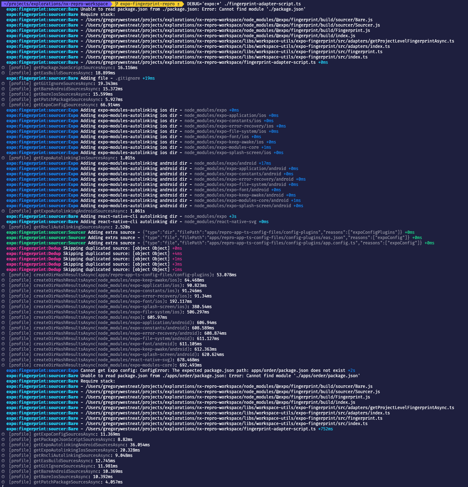

# NxReproWorkspace

## Repro Notes

### Basic Monorepo Example

#### fingerprint command

```
npx @expo/fingerprint apps/repro-app > fingerprint-repro-app.json
```

[`fingerprint-repro-app.json`](https://github.com/leggomuhgreggo/nx-issue-expo-babel/blob/expo-fingerprint-repro/fingerprint-repro-app.json)

The issue to highlight here is the package.json.

A common technique with RN monorepos is to use the [asterisk version](https://www.linkedin.com/pulse/things-i-have-learned-while-maintaining-javascript-monorepo-gorej/) hack, illustrated in the [linked example](https://docs.expo.dev/guides/monorepos/#using-the-package) from from expo + monorepo docs.

This usage is not currently supported by the `@expo/fingerprint` package.

### Local Config Plugin Example

#### fingerprint command

```
npx @expo/fingerprint apps/repro-app-local-config-plugins > fingerprint-repro-app-local-config-plugins.json
```

[`fingerprint-repro-app-local-config-plugins.json`](https://github.com/leggomuhgreggo/nx-issue-expo-babel/blob/expo-fingerprint-repro/fingerprint-repro-app-local-config-plugins.json)

Following the "Importing Plugins" [example](https://docs.expo.dev/guides/config-plugins/#importing-plugins) from the expo config plugin docs, this case has a "local" config plugin, defined in the project root.

This causes some undesirable behavior from the fingerprinting utility -- see [diff](https://github.com/leggomuhgreggo/nx-issue-expo-babel/commit/7ed58423340aa86544e02b36dd1a00bd517a6bb0#diff-4583c9267e0cae4ea84a3833d57e3b62da7de3b79ccaa4c0003cfb0ca79f7baa) from before / after config plugin addition.

Most significant is the addition of this source, which fingerprints the entire project directory

```
{
  "type": "dir",
  "filePath": "",
  "reasons": ["expoConfigPlugins", "expoConfig", "easBuild"],
  "hash": "d1622d7899821d29e1a1f2fb88866725343728e9"
},
```

And also dedupes the expo config files eg `app.json`, `eas.json`

### TS App Config Example

Note: Same root cause as above

#### fingerprint command

```
npx @expo/fingerprint apps/repro-app-ts-config-files > fingerprint-repro-app-ts-config-files.json
```

[`fingerprint-repro-app-ts-config-files.json`](https://github.com/leggomuhgreggo/nx-issue-expo-babel/blob/expo-fingerprint-repro/fingerprint-repro-app-ts-config-files.json)

Following the app config [example](https://docs.expo.dev/guides/typescript/#appconfigjs) in the expo + typescript docs, this case converts the `app.json` to `app.config.ts`

It turns out this issue was actually just another issue related to the local config plugin. Here's the [diff](https://github.com/leggomuhgreggo/nx-issue-expo-babel/commit/cc4c3b1953b6ec4d7c15d4758af59a2cf9826698) where I added a config plugin to this app -- and you can see how it causes the removal of `app.config.ts` from the fingerprint sources.

### Workspace Example

Figured I'd include this for reference

#### fingerprint command

```
npx @expo/fingerprint . > fingerprint-workspace.json
```

[`fingerprint-workspace.json`](https://github.com/leggomuhgreggo/nx-issue-expo-babel/blob/expo-fingerprint-repro/fingerprint-workspace.json)

## Workaround Example

I added a small lib `@workspace/expo-fingerprint` with a custom implementation on top of `@expo/fingerprint`, that adapts it to work better with Nx monorepo idiosyncrasies.

It works by fingerprinting both the project AND the workspace, selecting only the sources we're interested in -- then combines them into a single fingerprint -- and finally re-hashes to complete the adapted fingerprint object.

It exports two helper methods:

- `createCustomFingerprintAsync` - returns the whole fingerprint object
- `createCustomProjectHashAsync` - returns just the fingerprint hash

### Usage

I added a ts-node shell script to make it easy to use outside of a project.

#### Basic usage

```
./fingerprint-adapter-script.ts
```

#### With Time

```
time ./fingerprint-adapter-script.ts
```

<details><summary>time output</summary>

```
6.48s user 1.23s system 169% cpu 4.550 total
```

NOTE: I clocked this from the monorepo at work and it's a bit chonkier

```
27.95s user 6.64s system 153% cpu 22.540 total
```

</details>

#### With Debug

```
DEBUG='expo:*' ./fingerprint-adapter-script.ts
```

<details><summary>debug output</summary>



</details>
